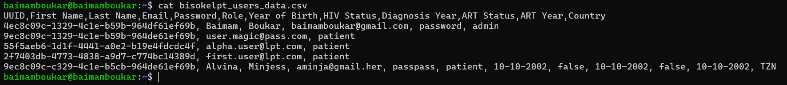
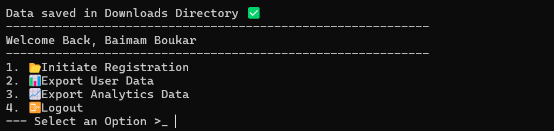
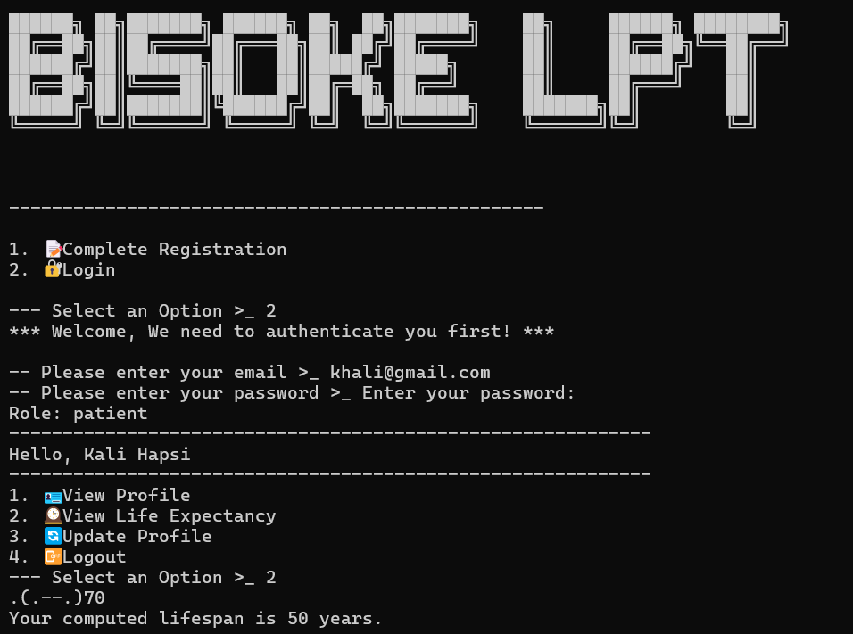
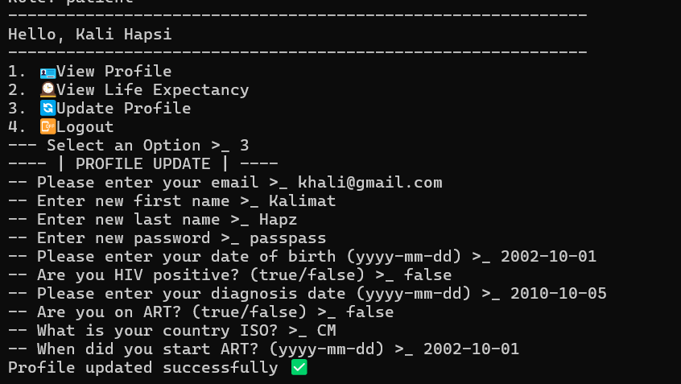
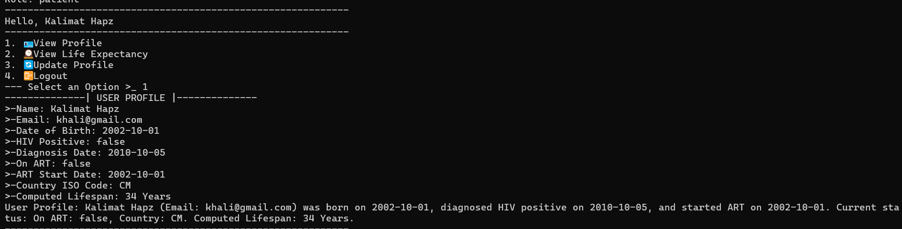

# Carnegie Mellon University Africa
## SIP 2024 | Java Programming | Life Prognosis Tool

-----
## BISSOKE 1 GROUP
- ADISSU SETEYE YIMAM        | ayimam
- ALVINA MINJA               | aminja
- BAIMAM BOUKAR JEAN JACQUES | bbaimamb

-----

### How to run the Application
To make it easier to run the application, we have included a `Makefile` in the project directory. To run the application, follow the steps below:
- Unzip the archive
- Open a terminal and navigate to the project directory
- Run the command `make runn` to run the program

__Note:__ You need a Unix-based terminal with Java environment well-configured to run the program

## Week 2 Submission
#### CREDENTIALS

- ADMINISTRATOR
  - Email: baimamboukar@gmail.com
  - Password: magicpass
- PATIENT
  - Email: khali@gmail.com
  - Password: passpass

### CHANGES INCORPORATED
#### General Feedback --- From TAs

- Provide more info on the User-analytics.txt file ⏳
- which analytics are you saving in the file. ⏳
- Do not export user hashed passwords ✅ (The passwords are hashed and saved in the store file along user info)
- Hide the user password as they type it in the terminal ✅ (The passowrd typing is now masked)
- For subsequent submissions include login credentials in the README.md file. ✅ (Creditionals are now included in the README.md, in the previous section of this document)
- Put classes in their own files to improve clarity and structure of your code ✅ (Classes are now better organized) 
- Use relative paths to make your program easy to run on different systems. ✅ (Relative paths are used accross the project)
- Your program should be bash-centric, accommodating cmd should be secondary and optional ✅ (The program now runs on bash and unix terminals, windows cmd is has been removed)
- It will be a good user experience to cut the process short in case they are not HIV positive. ⏳

### Screenshots
The screenshots are found in the `demos` folder.
1. DATA EXPORTED

2. USER DATA EXPORT

3. LIFESPAN COMPUTATION

4. UPDATE PROFILE

5. VIEW PROFILE

DATA FOR TESTING PURPOSES

4ec8c09c-1329-4c1e-b59b-964df61ef69b, Baimam, Boukar, baimamboukar@gmail.com, 37724862aceb5251a71041a5206e194ae8ead6a75e0c3edf5ff0af37a42c34c2, admin
9ec8c09c-c329-4c1e-b5cb-964de61ef69b, Alvina, Minjess, aminja@gmail.her, 74f11276b5ca0087b0c419de0e1d802c81d184b9d1349a50c5e1de6507089d18, patient, 2000-10-10, true, 2022-10-18, false, 2022-10-10, TZ
9ec8c09c-c329-4c1e-b5cb-964de61ef69c, Glory, ManU, manu@gmail.club, 74f11276b5ca0087b0c419de0e1d802c81d184b9d1349a50c5e1de6507089d18, patient, 2002-10-10, true, 2020-10-10, true, 2023-10-10, TZ
20e21f6a-82a6-48c9-a072-a93303cd7944, Kalimat, Hapz, khali@gmail.com, 74f11276b5ca0087b0c419de0e1d802c81d184b9d1349a50c5e1de6507089d18, patient, 2002-10-10, true, 2022-02-12, true, 2024-02-12, RW
20e21f6a-82a6-48c9-a072-a93303cd7924, Demz, Izz, izz@gmail.com, 74f11276b5ca0087b0c419de0e1d802c81d184b9d1349a50c5e1de6507089d18, patient, 2002-10-10, true, 2015-02-12, true, 2021-02-12, RW
20e21f6a-82a6-48c9-a072-a93303cd7728, Bisoke, One, bizzoke@gmail.com, 74f11276b5ca0087b0c419de0e1d802c81d184b9d1349a50c5e1de6507089d18, patient, 2001-10-20, true, 2019-02-12, true, 2023-02-12, RW
20e21f6a-82c6-48c9-a072-a93303cd7984, Mad, Patient, usher@bisoke.com, 74f11276b5ca0087b0c419de0e1d802c81d184b9d1349a50c5e1de6507089d18, patient, 2002-10-10, true, 2020-02-12, false, 2022-10-12, CM
20e21f6a-82c6-48c9-a072-a93303cd1984, Azette, TY, azeti@bisoke.com, 74f11276b5ca0087b0c419de0e1d802c81d184b9d1349a50c5e1de6507089d18, patient, 2000-10-10, true, 2024-02-12, true, 2024-06-12, CM
c4e32a1b-02c7-4b3e-a8a6-c6b74e0e9d7a, Kofi, Mensah, kofi.mensah@bisoke.one, 74f11276b5ca0087b0c419de0e1d802c81d184b9d1349a50c5e1de6507089d18, patient, 1992-05-12, true, 2016-03-11, true, 2024-05-13, GH
a7e41b2a-12f4-489e-b7a8-845f9146b9a7, Amina, Diallo, amina.diallo@bisoke.one, 74f11276b5ca0087b0c419de0e1d802c81d184b9d1349a50c5e1de6507089d18, patient, 1994-11-22, true, 2017-07-23, true, 2023-12-24, SN
e5a32c1d-34b7-458e-a7b4-c3a16d5e6f5e, Fatou, Ba, fatou.ba@bisoke.one, 74f11276b5ca0087b0c419de0e1d802c81d184b9d1349a50c5e1de6507089d18, patient, 200010-30, true, 2018-01-14, true, 2024-03-15, SN
f3b42d3e-53c8-4e7f-b9e8-a1f7c3e4b8a6, John, Okafor, john.okafor@bisoke.one, 74f11276b5ca0087b0c419de0e1d802c81d184b9d1349a50c5e1de6507089d18, patient, 1993-03-05, true, 201910-12, true, 2023-10-14, NG
a9d43e5f-67a9-4c8e-b0a1-c4a58e3f7a4d, Grace, Njoroge, grace.njoroge@bisoke.one, 74f11276b5ca0087b0c419de0e1d802c81d184b9d1349a50c5e1de6507089d18, patient, 1997-06-19, true, 2020-1110, true, 2024-0410, KE
c2b54e6e-89ca-4d7f-a1c2-d5a67e4f8c7b, Yacine, Ndiaye, yacine.ndiaye@bisoke.one, 74f11276b5ca0087b0c419de0e1d802c81d184b9d1349a50c5e1de6507089d18, patient, 2001-12-10, true, 2021-04-22, true, 2024-05-10, SN
d3c63f7f-0ada-4e8f-b2b3-e6a78e5f9d8c, Ibrahim, Kone, ibrahim.kone@bisoke.one, 74f11276b5ca0087b0c419de0e1d802c81d184b9d1349a50c5e1de6507089d18, patient, 1995-02-14, true, 2018-06-18, false, 2023-11-18, CI
e4d74f8a-1bcb-4f9e-b3c4-f7b89e6f0e9b, Amara, Kamara, amara.kamara@bisoke.one, 74f11276b5ca0087b0c419de0e1d802c81d184b9d1349a50c5e1de6507089d18, patient, 200010-03, true, 2021-05-20, true, 2024-06-12, SL
f5e85f9b-2cdc-4fae-b4d5-g8b9ae7f1f0a, Salif, Cissé, salif.cisse@bisoke.one, 74f11276b5ca0087b0c419de0e1d802c81d184b9d1349a50c5e1de6507089d18, patient, 1998-04-25, true, 2019-10-17, true, 2024-02-17, ML
g6f96fa0-3edd-4fab-b5e6-h9c1af8f2f1b, Abdi, Hassan, abdi.hassan@bisoke.one, 74f11276b5ca0087b0c419de0e1d802c81d184b9d1349a50c5e1de6507089d18, patient, 1999-07-29, true, 2020-07-21, true, 2024-05-22, SO
h7a07fa1-4fce-4fbc-b6f7-i0d2bf9f3f2c, Mariam, Toure, mariam.toure@bisoke.one, 74f11276b5ca0087b0c419de0e1d802c81d184b9d1349a50c5e1de6507089d18, patient, 1994-01-16, true, 2017-12-05, true, 2024-01-06, ML
i8b18fb2-5fdf-4fcd-b7g8-j1e3c0af4g3d, Boubacar, Sissoko, boubacar.sissoko@bisoke.one, 74f11276b5ca0087b0c419de0e1d802c81d184b9d1349a50c5e1de6507089d18, patient, 1991-11-28, true, 20151010, true, 2024-03-20, ML
j9c29fc3-6hfg-4gde-b8h9-k2f4d1bg5h4e, Aminata, Keita, aminata.keita@bisoke.one, 74f11276b5ca0087b0c419de0e1d802c81d184b9d1349a50c5e1de6507089d18, patient, 1993-03-07, true, 201610-14, true, 2024-04-14, GN
k0d30gd4-7igg-4hgf-b9i0-l3g5e2ch6i5f, Issa, Traoré, issa.traore@bisoke.one, 74f11276b5ca0087b0c419de0e1d802c81d184b9d1349a50c5e1de6507089d18, patient, 2002-01-18, true, 2021-03-02, true, 2024-07-18, BF
l1e41he5-8jhh-4ihi-c0j1-m4h6f3di7j6g, Hafsa, Mohammed, hafsa.mohammed@bisoke.one, 74f11276b5ca0087b0c419de0e1d802c81d184b9d1349a50c5e1de6507089d18, patient, 2003-06-24, true, 2022-05-15, true, 202410-14, ET
m2f52if6-9kji-4jij-d1k2-n5i7g4ej8k7h, Ali, Ahmed, ali.ahmed@bisoke.one, 74f11276b5ca0087b0c419de0e1d802c81d184b9d1349a50c5e1de6507089d18, patient, 19971010, true, 2020-12-19, true, 2024-10-18, DJ
n3g63jg7-0lkl-4kjk-e2l3-o6j8h5fk9l8i, Zainab, Musa, zainab.musa@bisoke.one, 74f11276b5ca0087b0c419de0e1d802c81d184b9d1349a50c5e1de6507089d18, patient, 1998-03-15, true, 2021-01-25, true, 2024-06-16, NG
o4h74kh8-1mml-4klk-f3m4-p7k9i6gl0m9j, Sani, Abubakar, sani.abubakar@bisoke.one, 74f11276b5ca0087b0c419de0e1d802c81d184b9d1349a50c5e1de6507089d18, patient, 2000-07-04, true, 2019-06-17, true, 2024-07-14, NG
p5i85li9-2nmm-4lml-g4n5-q8l0j7hm1n0k, Joseph, Banda, joseph.banda@bisoke.one, 74f11276b5ca0087b0c419de0e1d802c81d184b9d1349a50c5e1de6507089d18, patient, 1995-02-12, true, 2018-1110, false, 2023-11-15, ZM
q6j96mj0-3onn-4mnm-h5o6-r9m1k8in2o1l, Paul, Chisala, paul.chisala@bisoke.one, 74f11276b5ca0087b0c419de0e1d802c81d184b9d1349a50c5e1de6507089d18, patient, 1991-11-20, true, 2015-10-13, true, 2024-01-12, ZM
r7k07nk1-4pop-4non-i6p7-s0n2l9jo3p2m, Chipo, Nyoni, chipo.nyoni@bisoke.one, 74f11276b5ca0087b0c419de0e1d802c81d184b9d1349a50c5e1de6507089d18, patient, 1994-05-18, true, 2017-0410, true, 2024-03-21, ZW
s8l18ol2-5qqp-4opo-j7q8-t1o3m0kp4q3n, Tendai, Moyo, tendai.moyo@bisoke.one, 74f11276b5ca0087b0c419de0e1d802c81d184b9d1349a50c5e1de6507089d18, patient, 2000-02-26, true, 2021-07-11, true, 2024-06-17, ZW
t9m29pm3-6rqr-4pqp-k8r9-u2p4n1lq5r4o, Thandiwe, Ndlovu, thandiwe.ndlovu@bisoke.one, 74f11276b5ca0087b0c419de0e1d802c81d184b9d1349a50c5e1de6507089d18, patient, 1999-10-31, true, 202010-16, true, 2024-04-13, ZW
u0n30qn4-7srs-4qrq-l9s0-v3q5o2mr6s5p, Samuel, Phiri, samuel.phiri@bisoke.one, 74f11276b5ca0087b0c419de0e1d802c81d184b9d1349a50c5e1de6507089d18, patient, 1992-06-07, true, 2016-12-20, true, 2024-07-22, MW
v1o41ro5-8sts-4rsr-m0t1-w4r6p3ns7t6q, James, Banda, james.banda@bisoke.one, 74f11276b5ca0087b0c419de0e1d802c81d184b9d1349a50c5e1de6507089d18, patient, 1993-11-11, true, 201710-03, true, 2024-05-26, MW
w2p52sp6-9tuu-4sts-n1u2-x5s7q4ot8u7r, Maria, Mwansa, maria.mwansa@bisoke.one, 74f11276b5ca0087b0c419de0e1d802c81d184b9d1349a50c5e1de6507089d18, patient, 1997-04-20, true, 2020-02-12, true, 202410-13, MW
x3q63tq7-0uvu-4tut-o2v3-y6t8r5pu9v8s, Peter, Mulenga, peter.mulenga@bisoke.one, 74f11276b5ca0087b0c419de0e1d802c81d184b9d1349a50c5e1de6507089d18, patient, 200010-14, true, 2019-07-02, true, 2024-04-10, MW
y4r74ur8-1vwv-4uvu-p3w4-z7u9s6qv0w9t, Esther, Kalenga, esther.kalenga@bisoke.one, 74f11276b5ca0087b0c419de0e1d802c81d184b9d1349a50c5e1de6507089d18, patient, 1991-02-28, true, 2015-05-20, true, 2024-02-22, ZM
z5s85vs9-2wxx-4wvw-q4x5-a8v0t7rw1x0u, Gladys, Chikonde, gladys.chikonde@bisoke.one, 74f11276b5ca0087b0c419de0e1d802c81d184b9d1349a50c5e1de6507089d18, patient, 1994-04-17, true, 2017-0310, true, 2024-01-15, ZM
a6t96wt0-3xyy-4wxw-r5y6-b9w1u8sx2y1v, Mavis, Zulu, mavis.zulu@bisoke.one, 74f11276b5ca0087b0c419de0e1d802c81d184b9d1349a50c5e1de6507089d18, patient, 1998-01-13, true, 202010-12, true, 2024-03-19, ZM
b7u07xu1-4yzz-4xxy-s6z7-c0x2v9ty3z2w, Yvonne, Tembo, yvonne.tembo@bisoke.one, 74f11276b5ca0087b0c419de0e1d802c81d184b9d1349a50c5e1de6507089d18, patient, 19931010, true, 2016-12-01, true, 2024-06-24, ZM
c8v18yv2-5zaa-4yyy-t7a8-d1y3w0uz4a3x, Prisca, Mwape, prisca.mwape@bisoke.one, 74f11276b5ca0087b0c419de0e1d802c81d184b9d1349a50c5e1de6507089d18, patient, 2000-12-22, true, 2021-10-14, true, 2024-05-13, ZM
d9w29zw3-6abb-4yzz-u8b9-e2z4x1va5b4y, Emmanuel, Kapinga, emmanuel.kapinga@bisoke.one, 74f11276b5ca0087b0c419de0e1d802c81d184b9d1349a50c5e1de6507089d18, patient, 1992-05-06, true, 2016-11-12, true, 2024-07-24, TZ
e0x30ax4-7bcc-4zza-v9c0-f3a5y2wb6c5z, Flora, Kibanga, flora.kibanga@bisoke.one, 74f11276b5ca0087b0c419de0e1d802c81d184b9d1349a50c5e1de6507089d18, patient, 1991-07-19, true, 20151010, true, 2024-06-22, TZ
f1y41by5-8cdd-4aab-w0d1-g4b6z3xc7d6a, Asha, Ndayi, asha.ndayi@bisoke.one, 74f11276b5ca0087b0c419de0e1d802c81d184b9d1349a50c5e1de6507089d18, patient, 1995-12-05, true, 2018-06-17, true, 2024-05-24, TZ
g2z52cz6-9dee-4bbc-x1e2-h5c7a4yd8e7b, Bakari, Nchimbi, bakari.nchimbi@bisoke.one, 74f11276b5ca0087b0c419de0e1d802c81d184b9d1349a50c5e1de6507089d18, patient, 1993-03-02, true, 2016-12-04, true, 2024-04-20, TZ
h3a63da7-0eff-4ccd-y2f3-i6d8b5ze9f8c, Pendo, Simba, pendo.simba@bisoke.one, 74f11276b5ca0087b0c419de0e1d802c81d184b9d1349a50c5e1de6507089d18, patient, 199810-12, true, 2020-07-03, true, 2024-03-21, TZ
i4b74eb8-1ggg-4dee-z3g4-j7d9c6gf0g9d, Amina, Osei, amina.osei@bisoke.one, 74f11276b5ca0087b0c419de0e1d802c81d184b9d1349a50c5e1de6507089d18, patient, 1997-05-05, true, 202010-12, true, 2024-02-15, GH
j5c85fc9-2hhh-4fff-a4h5-k8e0d7hg1h0e, Kwame, Mensah, kwame.mensah@bisoke.one, 74f11276b5ca0087b0c419de0e1d802c81d184b9d1349a50c5e1de6507089d18, patient, 1994-03-11, true, 2017-06-18, true, 2024-04-23, GH
k6d96gd0-3iii-4ggg-b5i6-l9f1e8ih2i1f, Yaw, Boakye, yaw.boakye@bisoke.one, 74f11276b5ca0087b0c419de0e1d802c81d184b9d1349a50c5e1de6507089d18, patient, 1992-11-23, true, 2016-05-27, true, 2024-05-10, GH
l7e07he1-4jjj-4hhh-c6j7-m0g2f9ji3j2g, Abena, Amankwah, abena.amankwah@bisoke.one, 74f11276b5ca0087b0c419de0e1d802c81d184b9d1349a50c5e1de6507089d18, patient, 1999-0210, true, 202110-14, true, 202410-10, GH
m8f18if2-5kkk-4iii-d7k8-n1h3g0kj4k3h, Kofi, Owusu, kofi.owusu@bisoke.one, 74f11276b5ca0087b0c419de0e1d802c81d184b9d1349a50c5e1de6507089d18, patient, 200010-30, true, 2021-0610, true, 2024-07-18, GH
n9g29jg3-6lll-4jjj-e8l9-o2i4h1lk5l4i, Adwoa, Tetteh, adwoa.tetteh@bisoke.one, 74f11276b5ca0087b0c419de0e1d802c81d184b9d1349a50c5e1de6507089d18, patient, 1998-06-16, true, 2020-10-17, true, 2024-06-29, GH
o0h30kh4-7mmm-4kkk-f9m0-p3j5i2ml6m5j, Efua, Asare, efua.asare@bisoke.one, 74f11276b5ca0087b0c419de0e1d802c81d184b9d1349a50c5e1de6507089d18, patient, 1995-01-05, true, 2018-12-13, true, 2024-04-01, GH
p1i41li5-8nnn-4lll-g0n1-q4k6j3nm7n6k, Kojo, Agyeman, kojo.agyeman@bisoke.one, 74f11276b5ca0087b0c419de0e1d802c81d184b9d1349a50c5e1de6507089d18, patient, 1993-04-21, true, 2017-01-20, true, 2024-05-17, GH
q2j52mj6-9ooo-4mmm-h1o2-r5l7k4on8o7l, Nana, Opoku, nana.opoku@bisoke.one, 74f11276b5ca0087b0c419de0e1d802c81d184b9d1349a50c5e1de6507089d18, patient, 2000-10-19, true, 201910-05, true, 2024-06-22, GH
r3k63nk7-0ppp-4nnn-i2p3-s6m8l5po9p8m, Akosua, Djan, akosua.djan@bisoke.one, 74f11276b5ca0087b0c419de0e1d802c81d184b9d1349a50c5e1de6507089d18, patient, 2001-03-02, true, 2022-02-27, true, 2024-07-04, GH
s4l74ol8-1qqq-4ooo-j3q4-t7n9m6qp0q9n, Fatima, Ahmed, fatima.ahmed@bisoke.one, 74f11276b5ca0087b0c419de0e1d802c81d184b9d1349a50c5e1de6507089d18, patient, 1990-12-28, true, 201410-12, true, 202410-30, NG
t5m85pm9-2rrr-4ppp-k4r5-u8o0n7rq1r0o, Yusuf, Abdullahi, yusuf.abdullahi@bisoke.one, 74f11276b5ca0087b0c419de0e1d802c81d184b9d1349a50c5e1de6507089d18, patient, 199410-07, true, 2017-0310, true, 2024-06-26, NG
u6n96qn0-3sss-4qqq-l5s6-v9p1o8sr2s1p, Musa, Bako, musa.bako@bisoke.one, 74f11276b5ca0087b0c419de0e1d802c81d184b9d1349a50c5e1de6507089d18, patient, 1998-11-12, true, 2020-12-19, true, 2024-0510, NG
v7o07rn1-4ttt-4rrr-m6t7-w0q2p9ts3t2q, Halima, Usman, halima.usman@bisoke.one, 74f11276b5ca0087b0c419de0e1d802c81d184b9d1349a50c5e1de6507089d18, patient, 1995-04-11, true, 2018-02-24, true, 2024-04-18, NG
w8p18sn2-5uuu-4sss-n7u8-x1r3q0ut4u3r, Zainab, Ibrahim, zainab.ibrahim@bisoke.one, 74f11276b5ca0087b0c419de0e1d802c81d184b9d1349a50c5e1de6507089d18, patient, 1997-12-20, true, 2020-06-13, true, 2024-07-26, NG
x9q29to3-6vvv-4ttt-o8v9-y2s4r1vu5v4s, Aminu, Gambo, aminu.gambo@bisoke.one, 74f11276b5ca0087b0c419de0e1d802c81d184b9d1349a50c5e1de6507089d18, patient, 2000-07-23, true, 2019-04-16, true, 202410-14, NG
y0r30up4-7www-4uuu-p9w0-z3t5s2wv6w5t, Saidu, Mohammed, saidu.mohammed@bisoke.one, 74f11276b5ca0087b0c419de0e1d802c81d184b9d1349a50c5e1de6507089d18, patient, 2000-0110, true, 2021-07-20, true, 202410-13, NG

----

4ec8c09c-1329-4c1e-b59b-964df61ef69b, Baimam, Boukar, baimamboukar@gmail.com, 37724862aceb5251a71041a5206e194ae8ead6a75e0c3edf5ff0af37a42c34c2, admin
9ec8c09c-c329-4c1e-b5cb-964de61ef69b, Alvina, Minjess, aminja@gmail.her, 74f11276b5ca0087b0c419de0e1d802c81d184b9d1349a50c5e1de6507089d18, patient, 2000-10-10, true, 2022-10-18, false, 2022-10-10, TZ
9ec8c09c-c329-4c1e-b5cb-964de61ef69c, Glory, ManU, manu@gmail.club, 74f11276b5ca0087b0c419de0e1d802c81d184b9d1349a50c5e1de6507089d18, patient, 2002-10-10, true, 2020-10-10, true, 2023-10-10, TZ
20e21f6a-82a6-48c9-a072-a93303cd7944, Kalimat, Hapz, khali@gmail.com, 74f11276b5ca0087b0c419de0e1d802c81d184b9d1349a50c5e1de6507089d18, patient, 2002-10-10, true, 2022-02-12, true, 2024-02-12, RW
20e21f6a-82a6-48c9-a072-a93303cd7924, Demz, Izz, izz@gmail.com, 74f11276b5ca0087b0c419de0e1d802c81d184b9d1349a50c5e1de6507089d18, patient, 2002-10-10, true, 2015-02-12, true, 2021-02-12, RW
20e21f6a-82a6-48c9-a072-a93303cd7728, Bisoke, One, bizzoke@gmail.com, 74f11276b5ca0087b0c419de0e1d802c81d184b9d1349a50c5e1de6507089d18, patient, 2001-10-20, true, 2019-02-12, true, 2023-02-12, RW
20e21f6a-82c6-48c9-a072-a93303cd7984, Mad, Patient, usher@bisoke.com, 74f11276b5ca0087b0c419de0e1d802c81d184b9d1349a50c5e1de6507089d18, patient, 2002-10-10, true, 2020-02-12, false, 2022-10-12, CM
20e21f6a-82c6-48c9-a072-a93303cd1984, Azette, TY, azeti@bisoke.com, 74f11276b5ca0087b0c419de0e1d802c81d184b9d1349a50c5e1de6507089d18, patient, 2000-10-10, true, 2024-02-12, true, 2024-06-12, CM
c4e32a1b-02c7-4b3e-a8a6-c6b74e0e9d7a, Kofi, Mensah, kofi.mensah@bisoke.one, 74f11276b5ca0087b0c419de0e1d802c81d184b9d1349a50c5e1de6507089d18, patient, 1992-05-12, true, 2016-03-11, true, 2024-05-13, GH
a7e41b2a-12f4-489e-b7a8-845f9146b9a7, Amina, Diallo, amina.diallo@bisoke.one, 74f11276b5ca0087b0c419de0e1d802c81d184b9d1349a50c5e1de6507089d18, patient, 1994-11-22, true, 2017-07-23, true, 2023-12-24, SN
e5a32c1d-34b7-458e-a7b4-c3a16d5e6f5e, Fatou, Ba, fatou.ba@bisoke.one, 74f11276b5ca0087b0c419de0e1d802c81d184b9d1349a50c5e1de6507089d18, patient, 200010-30, true, 2018-01-14, true, 2024-03-15, SN
f3b42d3e-53c8-4e7f-b9e8-a1f7c3e4b8a6, John, Okafor, john.okafor@bisoke.one, 74f11276b5ca0087b0c419de0e1d802c81d184b9d1349a50c5e1de6507089d18, patient, 1993-03-05, true, 201910-12, true, 2023-10-14, NG
a9d43e5f-67a9-4c8e-b0a1-c4a58e3f7a4d, Grace, Njoroge, grace.njoroge@bisoke.one, 74f11276b5ca0087b0c419de0e1d802c81d184b9d1349a50c5e1de6507089d18, patient, 1997-06-19, true, 2020-1110, true, 2024-0410, KE
c2b54e6e-89ca-4d7f-a1c2-d5a67e4f8c7b, Yacine, Ndiaye, yacine.ndiaye@bisoke.one, 74f11276b5ca0087b0c419de0e1d802c81d184b9d1349a50c5e1de6507089d18, patient, 2001-12-10, true, 2021-04-22, true, 2024-05-10, SN
d3c63f7f-0ada-4e8f-b2b3-e6a78e5f9d8c, Ibrahim, Kone, ibrahim.kone@bisoke.one, 74f11276b5ca0087b0c419de0e1d802c81d184b9d1349a50c5e1de6507089d18, patient, 1995-02-14, true, 2018-06-18, false, 2023-11-18, CI
e4d74f8a-1bcb-4f9e-b3c4-f7b89e6f0e9b, Amara, Kamara, amara.kamara@bisoke.one, 74f11276b5ca0087b0c419de0e1d802c81d184b9d1349a50c5e1de6507089d18, patient, 200010-03, true, 2021-05-20, true, 2024-06-12, SL
f5e85f9b-2cdc-4fae-b4d5-g8b9ae7f1f0a, Salif, Cissé, salif.cisse@bisoke.one, 74f11276b5ca0087b0c419de0e1d802c81d184b9d1349a50c5e1de6507089d18, patient, 1998-04-25, true, 2019-10-17, true, 2024-02-17, ML
g6f96fa0-3edd-4fab-b5e6-h9c1af8f2f1b, Abdi, Hassan, abdi.hassan@bisoke.one, 74f11276b5ca0087b0c419de0e1d802c81d184b9d1349a50c5e1de6507089d18, patient, 1999-07-29, true, 2020-07-21, true, 2024-05-22, SO
h7a07fa1-4fce-4fbc-b6f7-i0d2bf9f3f2c, Mariam, Toure, mariam.toure@bisoke.one, 74f11276b5ca0087b0c419de0e1d802c81d184b9d1349a50c5e1de6507089d18, patient, 1994-01-16, true, 2017-12-05, true, 2024-01-06, ML
i8b18fb2-5fdf-4fcd-b7g8-j1e3c0af4g3d, Boubacar, Sissoko, boubacar.sissoko@bisoke.one, 74f11276b5ca0087b0c419de0e1d802c81d184b9d1349a50c5e1de6507089d18, patient, 1991-11-28, true, 20151010, true, 2024-03-20, ML
j9c29fc3-6hfg-4gde-b8h9-k2f4d1bg5h4e, Aminata, Keita, aminata.keita@bisoke.one, 74f11276b5ca0087b0c419de0e1d802c81d184b9d1349a50c5e1de6507089d18, patient, 1993-03-07, true, 201610-14, true, 2024-04-14, GN
k0d30gd4-7igg-4hgf-b9i0-l3g5e2ch6i5f, Issa, Traoré, issa.traore@bisoke.one, 74f11276b5ca0087b0c419de0e1d802c81d184b9d1349a50c5e1de6507089d18, patient, 2002-01-18, true, 2021-03-02, true, 2024-07-18, BF
l1e41he5-8jhh-4ihi-c0j1-m4h6f3di7j6g, Hafsa, Mohammed, hafsa.mohammed@bisoke.one, 74f11276b5ca0087b0c419de0e1d802c81d184b9d1349a50c5e1de6507089d18, patient, 2003-06-24, true, 2022-05-15, true, 202410-14, ET
m2f52if6-9kji-4jij-d1k2-n5i7g4ej8k7h, Ali, Ahmed, ali.ahmed@bisoke.one, 74f11276b5ca0087b0c419de0e1d802c81d184b9d1349a50c5e1de6507089d18, patient, 19971010, true, 2020-12-19, true, 2024-10-18, DJ
n3g63jg7-0lkl-4kjk-e2l3-o6j8h5fk9l8i, Zainab, Musa, zainab.musa@bisoke.one, 74f11276b5ca0087b0c419de0e1d802c81d184b9d1349a50c5e1de6507089d18, patient, 1998-03-15, true, 2021-01-25, true, 2024-06-16, NG
o4h74kh8-1mml-4klk-f3m4-p7k9i6gl0m9j, Sani, Abubakar, sani.abubakar@bisoke.one, 74f11276b5ca0087b0c419de0e1d802c81d184b9d1349a50c5e1de6507089d18, patient, 2000-07-04, true, 2019-06-17, true, 2024-07-14, NG
p5i85li9-2nmm-4lml-g4n5-q8l0j7hm1n0k, Joseph, Banda, joseph.banda@bisoke.one, 74f11276b5ca0087b0c419de0e1d802c81d184b9d1349a50c5e1de6507089d18, patient, 1995-02-12, true, 2018-1110, false, 2023-11-15, ZM
q6j96mj0-3onn-4mnm-h5o6-r9m1k8in2o1l, Paul, Chisala, paul.chisala@bisoke.one, 74f11276b5ca0087b0c419de0e1d802c81d184b9d1349a50c5e1de6507089d18, patient, 1991-11-20, true, 2015-10-13, true, 2024-01-12, ZM
r7k07nk1-4pop-4non-i6p7-s0n2l9jo3p2m, Chipo, Nyoni, chipo.nyoni@bisoke.one, 74f11276b5ca0087b0c419de0e1d802c81d184b9d1349a50c5e1de6507089d18, patient, 1994-05-18, true, 2017-0410, true, 2024-03-21, ZW
s8l18ol2-5qqp-4opo-j7q8-t1o3m0kp4q3n, Tendai, Moyo, tendai.moyo@bisoke.one, 74f11276b5ca0087b0c419de0e1d802c81d184b9d1349a50c5e1de6507089d18, patient, 2000-02-26, true, 2021-07-11, true, 2024-06-17, ZW
t9m29pm3-6rqr-4pqp-k8r9-u2p4n1lq5r4o, Thandiwe, Ndlovu, thandiwe.ndlovu@bisoke.one, 74f11276b5ca0087b0c419de0e1d802c81d184b9d1349a50c5e1de6507089d18, patient, 1999-10-31, true, 202010-16, true, 2024-04-13, ZW
u0n30qn4-7srs-4qrq-l9s0-v3q5o2mr6s5p, Samuel, Phiri, samuel.phiri@bisoke.one, 74f11276b5ca0087b0c419de0e1d802c81d184b9d1349a50c5e1de6507089d18, patient, 1992-06-07, true, 2016-12-20, true, 2024-07-22, MW
v1o41ro5-8sts-4rsr-m0t1-w4r6p3ns7t6q, James, Banda, james.banda@bisoke.one, 74f11276b5ca0087b0c419de0e1d802c81d184b9d1349a50c5e1de6507089d18, patient, 1993-11-11, true, 201710-03, true, 2024-05-26, MW
w2p52sp6-9tuu-4sts-n1u2-x5s7q4ot8u7r, Maria, Mwansa, maria.mwansa@bisoke.one, 74f11276b5ca0087b0c419de0e1d802c81d184b9d1349a50c5e1de6507089d18, patient, 1997-04-20, true, 2020-02-12, true, 202410-13, MW
x3q63tq7-0uvu-4tut-o2v3-y6t8r5pu9v8s, Peter, Mulenga, peter.mulenga@bisoke.one, 74f11276b5ca0087b0c419de0e1d802c81d184b9d1349a50c5e1de6507089d18, patient, 200010-14, true, 2019-07-02, true, 2024-04-10, MW
y4r74ur8-1vwv-4uvu-p3w4-z7u9s6qv0w9t, Esther, Kalenga, esther.kalenga@bisoke.one, 74f11276b5ca0087b0c419de0e1d802c81d184b9d1349a50c5e1de6507089d18, patient, 1991-02-28, true, 2015-05-20, true, 2024-02-22, ZM
z5s85vs9-2wxx-4wvw-q4x5-a8v0t7rw1x0u, Gladys, Chikonde, gladys.chikonde@bisoke.one, 74f11276b5ca0087b0c419de0e1d802c81d184b9d1349a50c5e1de6507089d18, patient, 1994-04-17, true, 2017-0310, true, 2024-01-15, ZM
a6t96wt0-3xyy-4wxw-r5y6-b9w1u8sx2y1v, Mavis, Zulu, mavis.zulu@bisoke.one, 74f11276b5ca0087b0c419de0e1d802c81d184b9d1349a50c5e1de6507089d18, patient, 1998-01-13, true, 202010-12, true, 2024-03-19, ZM
b7u07xu1-4yzz-4xxy-s6z7-c0x2v9ty3z2w, Yvonne, Tembo, yvonne.tembo@bisoke.one, 74f11276b5ca0087b0c419de0e1d802c81d184b9d1349a50c5e1de6507089d18, patient, 19931010, true, 2016-12-01, true, 2024-06-24, ZM
c8v18yv2-5zaa-4yyy-t7a8-d1y3w0uz4a3x, Prisca, Mwape, prisca.mwape@bisoke.one, 74f11276b5ca0087b0c419de0e1d802c81d184b9d1349a50c5e1de6507089d18, patient, 2000-12-22, true, 2021-10-14, true, 2024-05-13, ZM
d9w29zw3-6abb-4yzz-u8b9-e2z4x1va5b4y, Emmanuel, Kapinga, emmanuel.kapinga@bisoke.one, 74f11276b5ca0087b0c419de0e1d802c81d184b9d1349a50c5e1de6507089d18, patient, 1992-05-06, true, 2016-11-12, true, 2024-07-24, TZ
e0x30ax4-7bcc-4zza-v9c0-f3a5y2wb6c5z, Flora, Kibanga, flora.kibanga@bisoke.one, 74f11276b5ca0087b0c419de0e1d802c81d184b9d1349a50c5e1de6507089d18, patient, 1991-07-19, true, 20151010, true, 2024-06-22, TZ
f1y41by5-8cdd-4aab-w0d1-g4b6z3xc7d6a, Asha, Ndayi, asha.ndayi@bisoke.one, 74f11276b5ca0087b0c419de0e1d802c81d184b9d1349a50c5e1de6507089d18, patient, 1995-12-05, true, 2018-06-17, true, 2024-05-24, TZ
g2z52cz6-9dee-4bbc-x1e2-h5c7a4yd8e7b, Bakari, Nchimbi, bakari.nchimbi@bisoke.one, 74f11276b5ca0087b0c419de0e1d802c81d184b9d1349a50c5e1de6507089d18, patient, 1993-03-02, true, 2016-12-04, true, 2024-04-20, TZ
h3a63da7-0eff-4ccd-y2f3-i6d8b5ze9f8c, Pendo, Simba, pendo.simba@bisoke.one, 74f11276b5ca0087b0c419de0e1d802c81d184b9d1349a50c5e1de6507089d18, patient, 199810-12, true, 2020-07-03, true, 2024-03-21, TZ
4ec8c09c-1329-4c1e-b59b-964df61ef69b, Baimam, Boukar, baimamboukar@gmail.com, 37724862aceb5251a71041a5206e194ae8ead6a75e0c3edf5ff0af37a42c34c2, admin
9ec8c09c-c329-4c1e-b5cb-964de61ef6a9b, Alvina, Minjess, aminja@gmail.her, 74f11276b5ca0087b0c419de0e1d802c81d184b9d1349a50c5e1de6507089d18, patient, 2000-10-10, true, 2022-10-18, false, 2022-10-10, TZ
9ec8c09c-c329-4c1e-b5cb-964de61ef69c, Glory, ManU, manu@gmail.club, 74f11276b5ca0087b0c419de0e1d802c81d184b9d1349a50c5e1de6507089d18, patient, 2002-10-10, true, 2020-10-10, true, 2023-10-10, TZ
20e21f6a-82a6-48c9-a072-a93303cd7944, Kalimat, Hapz, khali@gmail.com, 74f11276b5ca0087b0c419de0e1d802c81d184b9d1349a50c5e1de6507089d18, patient, 2002-10-10, true, 2022-02-12, true, 2024-02-12, RW
20e21f6a-82a6-48c9-a072-a93303cd7924, Demz, Izz, izz@gmail.com, 74f11276b5ca0087b0c419de0e1d802c81d184b9d1349a50c5e1de6507089d18, patient, 2002-10-10, true, 2015-02-12, true, 2021-02-12, RW
20e21f6a-82a6-48c9-a072-a93303cd7728, Bisoke, One, bizzoke@gmail.com, 74f11276b5ca0087b0c419de0e1d802c81d184b9d1349a50c5e1de6507089d18, patient, 2001-10-20, true, 2019-02-12, true, 2023-02-12, RW
20e21f6a-82c6-48c9-a072-a93303cd7984, Mad, Patient, usher@bisoke.com, 74f11276b5ca0087b0c419de0e1d802c81d184b9d1349a50c5e1de6507089d18, patient, 2002-10-10, true, 2020-02-12, false, 2022-10-12, CM
20e21f6a-82c6-48c9-a072-a93303cd1984, Azette, TY, azeti@bisoke.com, 74f11276b5ca0087b0c419de0e1d802c81d184b9d1349a50c5e1de6507089d18, patient, 2000-10-10, true, 2024-02-12, true, 2024-06-12, CM
c4e32a1b-02c7-4b3e-a8a6-c6b74e0e9d7a, Kofi, Mensah, kofi.mensah@bisoke.one, 74f11276b5ca0087b0c419de0e1d802c81d184b9d1349a50c5e1de6507089d18, patient, 1992-05-12, true, 2016-03-11, true, 2024-05-13, GH
a7e41b2a-12f4-489e-b7a8-845f9146b9a7, Amina, Diallo, amina.diallo@bisoke.one, 74f11276b5ca0087b0c419de0e1d802c81d184b9d1349a50c5e1de6507089d18, patient, 1994-11-22, true, 2017-07-23, true, 2023-12-24, SN
e5a32c1d-34b7-458e-a7b4-c3a16d5e6f5e, Fatou, Ba, fatou.ba@bisoke.one, 74f11276b5ca0087b0c419de0e1d802c81d184b9d1349a50c5e1de6507089d18, patient, 200010-30, true, 2018-01-14, true, 2024-03-15, SN
f3b42d3e-53c8-4e7f-b9e8-a1f7c3e4b8a6, John, Okafor, john.okafor@bisoke.one, 74f11276b5ca0087b0c419de0e1d802c81d184b9d1349a50c5e1de6507089d18, patient, 1993-03-05, true, 201910-12, true, 2023-10-14, NG
a9d43e5f-67a9-4c8e-b0a1-c4a58e3f7a4d, Grace, Njoroge, grace.njoroge@bisoke.one, 74f11276b5ca0087b0c419de0e1d802c81d184b9d1349a50c5e1de6507089d18, patient, 1997-06-19, true, 2020-1110, true, 2024-0410, KE
c2b54e6e-89ca-4d7f-a1c2-d5a67e4f8c7b, Yacine, Ndiaye, yacine.ndiaye@bisoke.one, 74f11276b5ca0087b0c419de0e1d802c81d184b9d1349a50c5e1de6507089d18, patient, 2001-12-10, true, 2021-04-22, true, 2024-05-10, SN
d3c63f7f-0ada-4e8f-b2b3-e6a78e5f9d8c, Ibrahim, Kone, ibrahim.kone@bisoke.one, 74f11276b5ca0087b0c419de0e1d802c81d184b9d1349a50c5e1de6507089d18, patient, 1995-02-14, true, 2018-06-18, false, 2023-11-18, CI
e4d74f8a-1bcb-4f9e-b3c4-f7b89e6f0e9b, Amara, Kamara, amara.kamara@bisoke.one, 74f11276b5ca0087b0c419de0e1d802c81d184b9d1349a50c5e1de6507089d18, patient, 200010-03, true, 2021-05-20, true, 2024-06-12, SL
f5e85f9b-2cdc-4fae-b4d5-g8b9ae7f1f0a, Salif, Cissé, salif.cisse@bisoke.one, 74f11276b5ca0087b0c419de0e1d802c81d184b9d1349a50c5e1de6507089d18, patient, 1998-04-25, true, 2019-10-17, true, 2024-02-17, ML
g6f96fa0-3edd-4fab-b5e6-h9c1af8f2f1b, Abdi, Hassan, abdi.hassan@bisoke.one, 74f11276b5ca0087b0c419de0e1d802c81d184b9d1349a50c5e1de6507089d18, patient, 1999-07-29, true, 2020-07-21, true, 2024-05-22, SO
h7a07fa1-4fce-4fbc-b6f7-i0d2bf9f3f2c, Mariam, Toure, mariam.toure@bisoke.one, 74f11276b5ca0087b0c419de0e1d802c81d184b9d1349a50c5e1de6507089d18, patient, 1994-01-16, true, 2017-12-05, true, 2024-01-06, ML
i8b18fb2-5fdf-4fcd-b7g8-j1e3c0af4g3d, Boubacar, Sissoko, boubacar.sissoko@bisoke.one, 74f11276b5ca0087b0c419de0e1d802c81d184b9d1349a50c5e1de6507089d18, patient, 1991-11-28, true, 20151010, true, 2024-03-20, ML
j9c29fc3-6hfg-4gde-b8h9-k2f4d1bg5h4e, Aminata, Keita, aminata.keita@bisoke.one, 74f11276b5ca0087b0c419de0e1d802c81d184b9d1349a50c5e1de6507089d18, patient, 1993-03-07, true, 201610-14, true, 2024-04-14, GN
k0d30gd4-7igg-4hgf-b9i0-l3g5e2ch6i5f, Issa, Traoré, issa.traore@bisoke.one, 74f11276b5ca0087b0c419de0e1d802c81d184b9d1349a50c5e1de6507089d18, patient, 2002-01-18, true, 2021-03-02, true, 2024-07-18, BF
l1e41he5-8jhh-4ihi-c0j1-m4h6f3di7j6g, Hafsa, Mohammed, hafsa.mohammed@bisoke.one, 74f11276b5ca0087b0c419de0e1d802c81d184b9d1349a50c5e1de6507089d18, patient, 2003-06-24, true, 2022-05-15, true, 202410-14, ET
m2f52if6-9kji-4jij-d1k2-n5i7g4ej8k7h, Ali, Ahmed, ali.ahmed@bisoke.one, 74f11276b5ca0087b0c419de0e1d802c81d184b9d1349a50c5e1de6507089d18, patient, 19971010, true, 2020-12-19, true, 2024-10-18, DJ
n3g63jg7-0lkl-4kjk-e2l3-o6j8h5fk9l8i, Zainab, Musa, zainab.musa@bisoke.one, 74f11276b5ca0087b0c419de0e1d802c81d184b9d1349a50c5e1de6507089d18, patient, 1998-03-15, true, 2021-01-25, true, 2024-06-16, NG
o4h74kh8-1mml-4klk-f3m4-p7k9i6gl0m9j, Sani, Abubakar, sani.abubakar@bisoke.one, 74f11276b5ca0087b0c419de0e1d802c81d184b9d1349a50c5e1de6507089d18, patient, 2000-07-04, true, 2019-06-17, true, 2024-07-14, NG
p5i85li9-2nmm-4lml-g4n5-q8l0j7hm1n0k, Joseph, Banda, joseph.banda@bisoke.one, 74f11276b5ca0087b0c419de0e1d802c81d184b9d1349a50c5e1de6507089d18, patient, 1995-02-12, true, 2018-1110, false, 2023-11-15, ZM
q6j96mj0-3onn-4mnm-h5o6-r9m1k8in2o1l, Paul, Chisala, paul.chisala@bisoke.one, 74f11276b5ca0087b0c419de0e1d802c81d184b9d1349a50c5e1de6507089d18, patient, 1991-11-20, true, 2015-10-13, true, 2024-01-12, ZM
r7k07nk1-4pop-4non-i6p7-s0n2l9jo3p2m, Chipo, Nyoni, chipo.nyoni@bisoke.one, 74f11276b5ca0087b0c419de0e1d802c81d184b9d1349a50c5e1de6507089d18, patient, 1994-05-18, true, 2017-0410, true, 2024-03-21, ZW
s8l18ol2-5qqp-4opo-j7q8-t1o3m0kp4q3n, Tendai, Moyo, tendai.moyo@bisoke.one, 74f11276b5ca0087b0c419de0e1d802c81d184b9d1349a50c5e1de6507089d18, patient, 2000-02-26, true, 2021-07-11, true, 2024-06-17, ZW
t9m29pm3-6rqr-4pqp-k8r9-u2p4n1lq5r4o, Thandiwe, Ndlovu, thandiwe.ndlovu@bisoke.one, 74f11276b5ca0087b0c419de0e1d802c81d184b9d1349a50c5e1de6507089d18, patient, 1999-10-31, true, 202010-16, true, 2024-04-13, ZW
u0n30qn4-7srs-4qrq-l9s0-v3q5o2mr6s5p, Samuel, Phiri, samuel.phiri@bisoke.one, 74f11276b5ca0087b0c419de0e1d802c81d184b9d1349a50c5e1de6507089d18, patient, 1992-06-07, true, 2016-12-20, true, 2024-07-22, MW
v1o41ro5-8sts-4rsr-m0t1-w4r6p3ns7t6q, James, Banda, james.banda@bisoke.one, 74f11276b5ca0087b0c419de0e1d802c81d184b9d1349a50c5e1de6507089d18, patient, 1993-11-11, true, 201710-03, true, 2024-05-26, MW
w2p52sp6-9tuu-4sts-n1u2-x5s7q4ot8u7r, Maria, Mwansa, maria.mwansa@bisoke.one, 74f11276b5ca0087b0c419de0e1d802c81d184b9d1349a50c5e1de6507089d18, patient, 1997-04-20, true, 2020-02-12, true, 202410-13, MW
x3q63tq7-0uvu-4tut-o2v3-y6t8r5pu9v8s, Peter, Mulenga, peter.mulenga@bisoke.one, 74f11276b5ca0087b0c419de0e1d802c81d184b9d1349a50c5e1de6507089d18, patient, 200010-14, true, 2019-07-02, true, 2024-04-10, MW
y4r74ur8-1vwv-4uvu-p3w4-z7u9s6qv0w9t, Esther, Kalenga, esther.kalenga@bisoke.one, 74f11276b5ca0087b0c419de0e1d802c81d184b9d1349a50c5e1de6507089d18, patient, 1991-02-28, true, 2015-05-20, true, 2024-02-22, ZM
z5s85vs9-2wxx-4wvw-q4x5-a8v0t7rw1x0u, Gladys, Chikonde, gladys.chikonde@bisoke.one, 74f11276b5ca0087b0c419de0e1d802c81d184b9d1349a50c5e1de6507089d18, patient, 1994-04-17, true, 2017-0310, true, 2024-01-15, ZM
a6t96wt0-3xyy-4wxw-r5y6-b9w1u8sx2y1v, Mavis, Zulu, mavis.zulu@bisoke.one, 74f11276b5ca0087b0c419de0e1d802c81d184b9d1349a50c5e1de6507089d18, patient, 1998-01-13, true, 202010-12, true, 2024-03-19, ZM
b7u07xu1-4yzz-4xxy-s6z7-c0x2v9ty3z2w, Yvonne, Tembo, yvonne.tembo@bisoke.one, 74f11276b5ca0087b0c419de0e1d802c81d184b9d1349a50c5e1de6507089d18, patient, 19931010, true, 2016-12-01, true, 2024-06-24, ZM
c8v18yv2-5zaa-4yyy-t7a8-d1y3w0uz4a3x, Prisca, Mwape, prisca.mwape@bisoke.one, 74f11276b5ca0087b0c419de0e1d802c81d184b9d1349a50c5e1de6507089d18, patient, 2000-12-22, true, 2021-10-14, true, 2024-05-13, ZM
d9w29zw3-6abb-4yzz-u8b9-e2z4x1va5b4y, Emmanuel, Kapinga, emmanuel.kapinga@bisoke.one, 74f11276b5ca0087b0c419de0e1d802c81d184b9d1349a50c5e1de6507089d18, patient, 1992-05-06, true, 2016-11-12, true, 2024-07-24, TZ
e0x30ax4-7bcc-4zza-v9c0-f3a5y2wb6c5z, Flora, Kibanga, flora.kibanga@bisoke.one, 74f11276b5ca0087b0c419de0e1d802c81d184b9d1349a50c5e1de6507089d18, patient, 1991-07-19, true, 20151010, true, 2024-06-22, TZ
f1y41by5-8cdd-4aab-w0d1-g4b6z3xc7d6a, Asha, Ndayi, asha.ndayi@bisoke.one, 74f11276b5ca0087b0c419de0e1d802c81d184b9d1349a50c5e1de6507089d18, patient, 1995-12-05, true, 2018-06-17, true, 2024-05-24, TZ
g2z52cz6-9dee-4bbc-x1e2-h5c7a4yd8e7b, Bakari, Nchimbi, bakari.nchimbi@bisoke.one, 74f11276b5ca0087b0c419de0e1d802c81d184b9d1349a50c5e1de6507089d18, patient, 1993-03-02, true, 2016-12-04, true, 2024-04-20, TZ
h3a63da7-0eff-4ccd-y2f3-i6d8b5ze9f8c, Pendo, Simba, pendo.simba@bisoke.one, 74f11276b5ca0087b0c419de0e1d802c81d184b9d1349a50c5e1de6507089d18, patient, 199810-12, true, 2020-07-03, true, 2024-03-21, TZ
i4b74eb8-1ggg-4dee-z3g4-j7d9c6gf0g9d, Amina, Osei, amina.osei@bisoke.one, 74f11276b5ca0087b0c419de0e1d802c81d184b9d1349a50c5e1de6507089d18, patient, 1997-05-05, true, 202010-12, true, 2024-02-15, GH
j5c85fc9-2hhh-4fff-a4h5-k8e0d7hg1h0e, Kwame, Mensah, kwame.mensah@bisoke.one, 74f11276b5ca0087b0c419de0e1d802c81d184b9d1349a50c5e1de6507089d18, patient, 1994-03-11, true, 2017-06-18, true, 2024-04-23, GH
k6d96gd0-3iii-4ggg-b5i6-l9f1e8ih2i1f, Yaw, Boakye, yaw.boakye@bisoke.one, 74f11276b5ca0087b0c419de0e1d802c81d184b9d1349a50c5e1de6507089d18, patient, 1992-11-23, true, 2016-05-27, true, 2024-05-10, GH
l7e07he1-4jjj-4hhh-c6j7-m0g2f9ji3j2g, Abena, Amankwah, abena.amankwah@bisoke.one, 74f11276b5ca0087b0c419de0e1d802c81d184b9d1349a50c5e1de6507089d18, patient, 1999-0210, true, 202110-14, true, 202410-10, GH
m8f18if2-5kkk-4iii-d7k8-n1h3g0kj4k3h, Kofi, Owusu, kofi.owusu@bisoke.one, 74f11276b5ca0087b0c419de0e1d802c81d184b9d1349a50c5e1de6507089d18, patient, 200010-30, true, 2021-0610, true, 2024-07-18, GH
n9g29jg3-6lll-4jjj-e8l9-o2i4h1lk5l4i, Adwoa, Tetteh, adwoa.tetteh@bisoke.one, 74f11276b5ca0087b0c419de0e1d802c81d184b9d1349a50c5e1de6507089d18, patient, 1998-06-16, true, 2020-10-17, true, 2024-06-29, GH
o0h30kh4-7mmm-4kkk-f9m0-p3j5i2ml6m5j, Efua, Asare, efua.asare@bisoke.one, 74f11276b5ca0087b0c419de0e1d802c81d184b9d1349a50c5e1de6507089d18, patient, 1995-01-05, true, 2018-12-13, true, 2024-04-01, GH
p1i41li5-8nnn-4lll-g0n1-q4k6j3nm7n6k, Kojo, Agyeman, kojo.agyeman@bisoke.one, 74f11276b5ca0087b0c419de0e1d802c81d184b9d1349a50c5e1de6507089d18, patient, 1993-04-21, true, 2017-01-20, true, 2024-05-17, GH
q2j52mj6-9ooo-4mmm-h1o2-r5l7k4on8o7l, Nana, Opoku, nana.opoku@bisoke.one, 74f11276b5ca0087b0c419de0e1d802c81d184b9d1349a50c5e1de6507089d18, patient, 2000-10-19, true, 201910-05, true, 2024-06-22, GH
r3k63nk7-0ppp-4nnn-i2p3-s6m8l5po9p8m, Akosua, Djan, akosua.djan@bisoke.one, 74f11276b5ca0087b0c419de0e1d802c81d184b9d1349a50c5e1de6507089d18, patient, 2001-03-02, true, 2022-02-27, true, 2024-07-04, GH
s4l74ol8-1qqq-4ooo-j3q4-t7n9m6qp0q9n, Fatima, Ahmed, fatima.ahmed@bisoke.one, 74f11276b5ca0087b0c419de0e1d802c81d184b9d1349a50c5e1de6507089d18, patient, 1990-12-28, true, 201410-12, true, 202410-30, NG
t5m85pm9-2rrr-4ppp-k4r5-u8o0n7rq1r0o, Yusuf, Abdullahi, yusuf.abdullahi@bisoke.one, 74f11276b5ca0087b0c419de0e1d802c81d184b9d1349a50c5e1de6507089d18, patient, 199410-07, true, 2017-0310, true, 2024-06-26, NG
u6n96qn0-3sss-4qqq-l5s6-v9p1o8sr2s1p, Musa, Bako, musa.bako@bisoke.one, 74f11276b5ca0087b0c419de0e1d802c81d184b9d1349a50c5e1de6507089d18, patient, 1998-11-12, true, 2020-12-19, true, 2024-0510, NG
v7o07rn1-4ttt-4rrr-m6t7-w0q2p9ts3t2q, Halima, Usman, halima.usman@bisoke.one, 74f11276b5ca0087b0c419de0e1d802c81d184b9d1349a50c5e1de6507089d18, patient, 1995-04-11, true, 2018-02-24, true, 2024-04-18, NG
w8p18sn2-5uuu-4sss-n7u8-x1r3q0ut4u3r, Zainab, Ibrahim, zainab.ibrahim@bisoke.one, 74f11276b5ca0087b0c419de0e1d802c81d184b9d1349a50c5e1de6507089d18, patient, 1997-12-20, true, 2020-06-13, true, 2024-07-26, NG
x9q29to3-6vvv-4ttt-o8v9-y2s4r1vu5v4s, Aminu, Gambo, aminu.gambo@bisoke.one, 74f11276b5ca0087b0c419de0e1d802c81d184b9d1349a50c5e1de6507089d18, patient, 2000-07-23, true, 2019-04-16, true, 202410-14, NG
y0r30up4-7www-4uuu-p9w0-z3t5s2wv6w5t, Saidu, Mohammed, saidu.mohammed@bisoke.one, 74f11276b5ca0087b0c419de0e1d802c81d184b9d1349a50c5e1de6507089d18, patient, 2000-0110, true, 2021-07-20, true, 202410-13, NG

