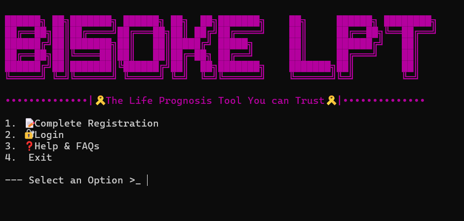
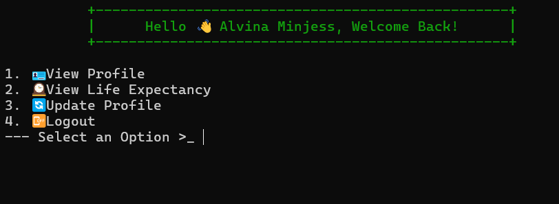
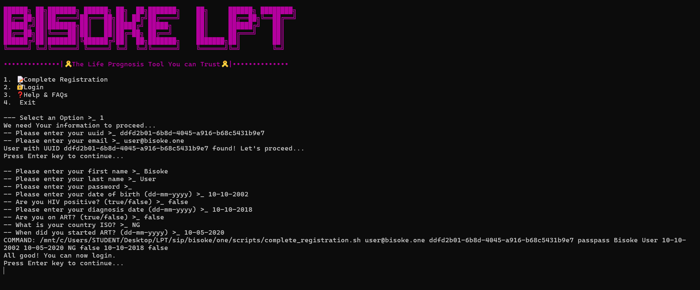
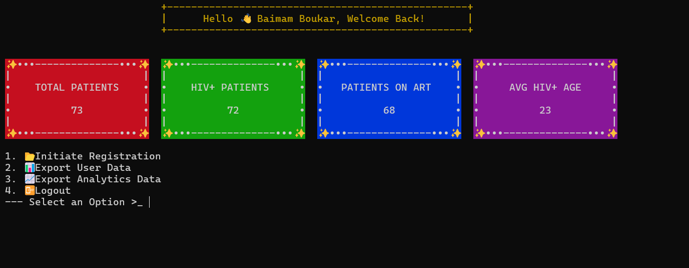
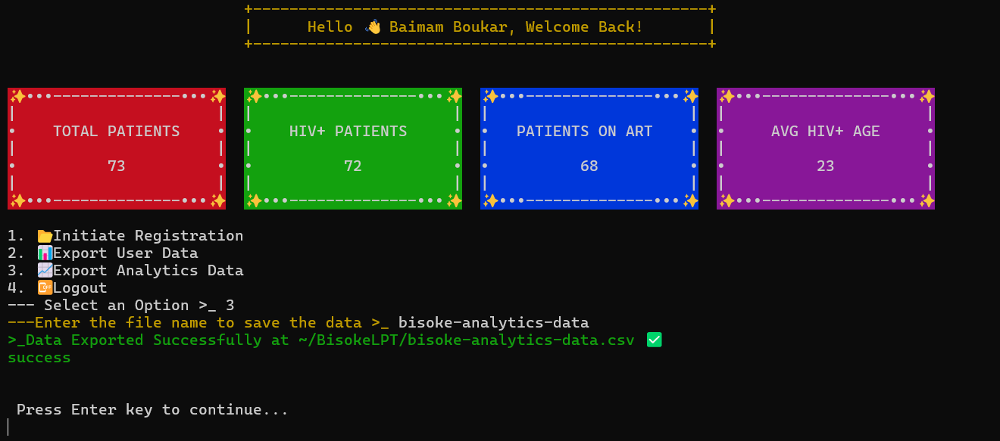

# Carnegie Mellon University Africa
## SIP 2024 | Java Programming | Life Prognosis Tool

-----
## BISSOKE 1 GROUP
- ADISSU SETEYE YIMAM        | ayimam
- ALVINA MINJA               | aminja
- BAIMAM BOUKAR JEAN JACQUES | bbaimamb

-----

### How to run the Application
To make it easier to run the application, we have included a `Makefile` in the project directory. To run the application, follow the steps below:
- Unzip the archive
- Open a terminal and navigate to the project directory
- Run the command `make runn` to run the program

__Note:__ You need a Unix-based terminal with Java environment well-configured to run the program

#### CREDENTIALS

- ADMINISTRATOR
  - Email: baimamboukar@gmail.com
  - Password: magicpass
- PATIENT
  - Email: khali@gmail.com
  - Password: passpass

### CHANGES INCORPORATED
#### General Feedback --- From TAs

- Provide more info on the User-analytics.txt file ✅
- which analytics are you saving in the file. ✅
- Do not export user hashed passwords ✅ (The passwords are hashed and saved in the store file along user info)
- Hide the user password as they type it in the terminal ✅ (The passowrd typing is now masked)
- For subsequent submissions include login credentials in the README.md file. ✅ (Creditionals are now included in the README.md, in the previous section of this document)
- Put classes in their own files to improve clarity and structure of your code ✅ (Classes are now better organized) 
- Use relative paths to make your program easy to run on different systems. ✅ (Relative paths are used accross the project)
- Your program should be bash-centric, accommodating cmd should be secondary and optional ✅ (The program now runs on bash and unix terminals, windows cmd is has been removed)

### Screenshots
The screenshots are found in the `demos` folder.
1. DATA EXPORTED

2. USER DATA EXPORT

3. LIFESPAN COMPUTATION

4. UPDATE PROFILE

5. VIEW PROFILE

------WEERK III SUBMISSION-----

